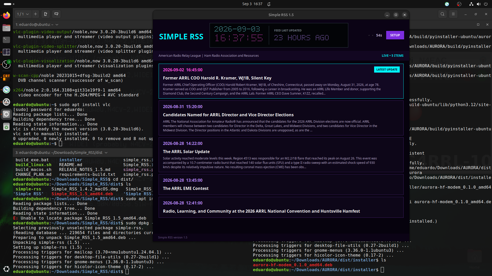
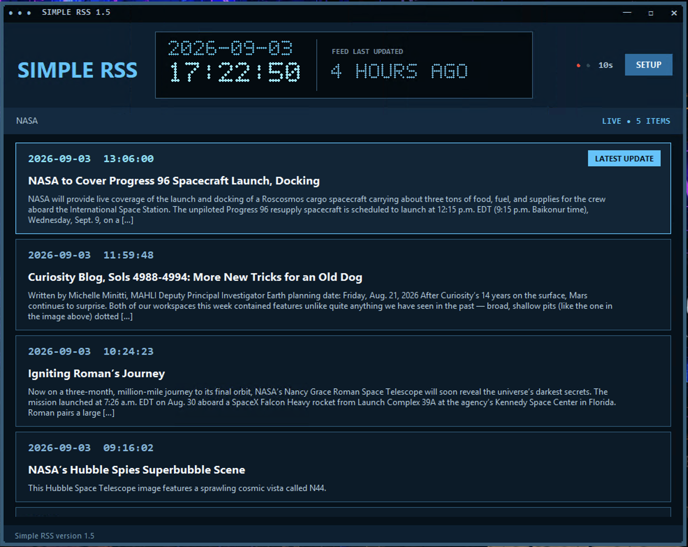

# Simple RSS 1.5


**Screenshots:**
<p></p> 
macOS


Ubuntu Linux

Windows


A compact Windows, macOS, and Linux desktop RSS/Atom reader with selectable visual themes.

## Version 1.5 updates

- Added native macOS application and DMG builds alongside the Windows application and installer.
- Added unlimited Saved Feeds memory, automatic feed-name labels, and controls for removing saved feeds.
- Added an optional per-feed stale-update alert with escalating visual warnings.
- Added a theme-aware, Unix-inspired custom window bar and resizing behavior on Windows.
- Improved RSS and Atom compatibility, including alternate links, relative URLs, additional timestamps, and missing-link fallbacks.
- Strengthened networking with HTTPS certificate support, response-size limits, content validation, conditional requests, and broader `Retry-After` handling.
- Improved application reliability through thread-safe background updates and safer link handling.
- Improved settings recovery so an invalid preference does not discard otherwise valid saved settings.
- Corrected Windows handling of older feed timestamps and visual glitches around the custom window frame.
- Improved feed identification by showing extracted feed titles instead of long URLs wherever practical.
- Stabilized the feed-age display and added a compact reload countdown indicator.
- Added focused automated tests and pinned build dependencies for reproducible packaging.
- Added documentation about unsigned Windows and macOS release warnings.
- Kept release binaries outside Git so installers can be uploaded directly as GitHub Release assets.

## Features

- User-configurable RSS or Atom feed URL through **SETUP**
- Shows only the five newest entries, with the latest item first
- Every feed update is clickable and opens in the operating system's default browser
- Displays the feed-age delta beside the live date/time, based on the newest entry timestamp—not the last reload
- User-selectable reload intervals: 10 seconds, 15 seconds, 30 seconds (default), 1 minute, 5 minutes, or 10 minutes
- Tiny white LED flashes during the final five seconds before each reload
- Optional per-feed stale alert: amber after 5 minutes, red after 10 minutes, and double-speed red after 15 minutes
- Canvas-rendered dot-matrix date, time, and feed-age display; no external digital font is required
- Transparent (not a browser emulation) `SimpleRSS` HTTP User-Agent.
- Optional contact email, transmitted only when the user enters one
- Conditional HTTP requests using ETag and Last-Modified when supported
- Respects server Retry-After instructions for HTTP 429 and 503 responses
- Six selectable themes: Neon Dark, Beige Simple, Red Dark, Blue Medic, Orange, and Gray 95
- Setup dropdown controls and their expanded menus match the active theme
- Windows uses a theme-aware Unix-inspired custom title bar with subtle themed resizing controls
- Native macOS application bundle and DMG build are supported
- Embedded application icon for the window, taskbar, executable, shortcuts, and installer
- Feed URL, optional contact email, reload interval, selected theme, and window geometry are remembered locally
- Remembers any number of feed URLs, shows their feed titles in a compact dropdown, and lets users delete saved feeds
- Shows the feed title rather than the full URL in the main status bar
- No telemetry, analytics, or tracking
- Bundled CA certificates keep HTTPS verification enabled in standalone builds

## Run from source

1. Install Python 3.11 or newer with Tk support.
2. Install the HTTPS certificate dependency with `python -m pip install -r requirements.txt`.
3. On Windows, double-click `simple_rss.py` or run `py simple_rss.py`.
4. On macOS, run `python3 simple_rss.py`.

## Build the standalone EXE

Double-click `build_exe.bat`. The finished executable is created as:

`dist\Simple RSS.exe`

## Build the installer

1. Build the EXE first.
2. Install Inno Setup 6.
3. Open `Simple_RSS.iss`.
4. Compile the script.

The installer is created in the `installer` folder and installs under `C:\Program Files\Simple RSS` with administrator privileges.

## Build the macOS application

Run:

```sh
./build_macos.sh
```

The script builds both:

- `dist/Simple RSS.app`
- `dist/Simple_RSS_1.5_macOS.dmg`

The application is built for the architecture of the Python interpreter running the script. The generated bundle receives a local ad-hoc signature, but distributing it to other Macs without Gatekeeper warnings requires Apple Developer ID signing and notarization.

## Build the Linux package

Run on a supported Linux system:

```sh
chmod +x build_linux.sh
./build_linux.sh
```

The script detects the distribution, installs the required build tools, runs the automated tests, builds a standalone application, and creates the native package in `dist/`:

- Ubuntu and Debian-family systems produce a versioned `.deb` package.
- Fedora and compatible systems produce a versioned `.rpm` package.

Installing system build dependencies may require one `sudo` password prompt. Use `./build_linux.sh --install` to install the completed package, or `./build_linux.sh --skip-dependencies` when all build requirements are already installed. Linux release packages must be built on Linux of the corresponding CPU architecture.

## Unsigned installer warning

The Windows installer, macOS release, and Linux packages are not signed with commercial platform developer certificates or distribution signing keys. Windows may therefore display a Microsoft Defender SmartScreen or **Unknown Publisher** warning, macOS Gatekeeper may warn that it cannot verify the developer or initially prevent the app from opening, and Linux package tools may report that a package is unsigned. Download release files only from the official project’s GitHub Releases page and verify published checksums when available.

## Compliance and privacy

Simple RSS identifies itself honestly as an RSS/Atom reader. It does not automatically send an email address or a fictitious `From` header. A contact address is sent only after the user explicitly enters one in Setup. This may be required by providers such as local government etcetera, keeping it compliant and legal.

Conditional requests reduce unnecessary downloads. When a server returns `304 Not Modified`, the existing feed remains displayed. When a server supplies either form of `Retry-After`—seconds or an HTTP date—with HTTP 429 or 503, Simple RSS delays the next request accordingly.


## Feed navigation

The five feed entries remain inside a clipped viewport. Use the mouse wheel, touchpad, Page Up/Page Down, Home, or End to scroll long entries. No scrollbar is displayed (that is intentional).

## RSS Feed Sites for Amateur Radio

Below are 10 of the best RSS feeds for amateur radio news, selected to provide broad coverage of the **United States, United Kingdom, Brazil, France, Japan**, plus important international DX and satellite news. These are all well-established sources with active or regularly maintained feeds. ([RSS Database - FeedSpot][1])

| #  | Country          | Source                              | RSS Feed URL                                                                   |
| --- | ---------------- | ----------------------------------- | ------------------------------------------------------------------------------ |
| 1  | 🇺🇸 USA         | ARRL News                           | [https://www.arrl.org/arrl.rss](https://www.arrl.org/arrl.rss)                 |
| 2  | 🇬🇧 UK          | RSGB News                           | [https://rsgb.org/feed/](https://rsgb.org/feed/)                               |
| 3  | 🇬🇧 UK          | Southgate Amateur Radio News        | [https://www.southgatearc.org/sarc.rss](https://www.southgatearc.org/sarc.rss) |
| 4  | 🇧🇷 Brazil      | LABRE News                          | [https://www.labre.org.br/feed/](https://www.labre.org.br/feed/)               |
| 5  | 🇫🇷 France      | REF (Réseau des Émetteurs Français) | [https://www.r-e-f.org/feed/](https://www.r-e-f.org/feed/)                     |
| 6  | 🇯🇵 Japan       | JARL News                           | [https://www.jarl.org/English/rss.xml](https://www.jarl.org/English/rss.xml)   |
| 7  | 🌍 International | IARU Region 1 News                  | [https://www.iaru-r1.org/feed/](https://www.iaru-r1.org/feed/)                 |
| 8  | 🌍 International | AMSAT News                          | [https://www.amsat.org/feed/](https://www.amsat.org/feed/)                     |
| 9  | 🌍 International | AmateurRadio.com                    | [https://www.amateurradio.com/feed/](https://www.amateurradio.com/feed/)       |
| 10 | 🌍 International | SWLing Post                         | [https://swling.com/blog/feed/](https://swling.com/blog/feed/)                 |

### Best combination for a desktop RSS reader

If you only subscribe to a handful, I'd recommend these:

* ARRL (US)
* RSGB (UK)
* Southgate ARC (international/DX)
* LABRE (Brazil)
* REF (France)
* JARL (Japan)
* AMSAT
* AmateurRadio.com
* IARU Region 1
* SWLing Post

This mix gives excellent coverage of:

* Regulatory news
* HF/VHF/UHF operating
* DXpeditions
* Contesting
* Satellites
* Emergency communications
* Digital modes
* Equipment reviews
* Club news
* International amateur radio developments

These feeds are among the most commonly referenced by amateur-radio RSS aggregators and club news services. ([hampager.de][2])

## RSS Feed Sites for U.S. Government Science

Here are 10 useful official U.S. government science RSS feeds. I prioritized general science news, research, space, oceans, environmental health, and real-time earth-science information.

| #  | Agency | Source                                             | RSS Feed URL                                                                                                                                                       |
| --- | ------ | -------------------------------------------------- | ------------------------------------------------------------------------------------------------------------------------------------------------------------------ |
| 1  | NASA   | News Releases                                      | [https://www.nasa.gov/news-release/feed/](https://www.nasa.gov/news-release/feed/)                                                                                  |
| 2  | NASA   | Recently Published Content                         | [https://www.nasa.gov/feed/](https://www.nasa.gov/feed/)                                                                                                            |
| 3  | NASA   | Technology                                         | [https://www.nasa.gov/technology/feed/](https://www.nasa.gov/technology/feed/)                                                                                      |
| 4  | NASA   | Jet Propulsion Laboratory News                     | [https://www.jpl.nasa.gov/feeds/news/](https://www.jpl.nasa.gov/feeds/news/)                                                                                        |
| 5  | NOAA   | National Ocean Service News                        | [https://oceanservice.noaa.gov/rss/nosnews.xml](https://oceanservice.noaa.gov/rss/nosnews.xml)                                                                      |
| 6  | NOAA   | National Ocean Service Newsroom                    | [https://oceanservice.noaa.gov/newsroom/nosmedia.xml](https://oceanservice.noaa.gov/newsroom/nosmedia.xml)                                                          |
| 7  | NOAA   | Pacific Marine Environmental Laboratory Highlights | [https://www.pmel.noaa.gov/feed/rss-feed-pmel-whats-new.xml](https://www.pmel.noaa.gov/feed/rss-feed-pmel-whats-new.xml)                                            |
| 8  | USGS   | All Earthquakes, Past Day                          | [https://earthquake.usgs.gov/earthquakes/feed/v1.0/summary/all_day.atom](https://earthquake.usgs.gov/earthquakes/feed/v1.0/summary/all_day.atom)                      |
| 9  | NIEHS  | News                                               | [https://www.niehs.nih.gov/news/newsroom/rssfeed/rss_news.xml](https://www.niehs.nih.gov/news/newsroom/rssfeed/rss_news.xml)                                        |
| 10 | NIEHS  | Recently Published Research                        | [https://www.niehs.nih.gov/news/newsroom/rssfeed/rss_recently_published_research.xml](https://www.niehs.nih.gov/news/newsroom/rssfeed/rss_recently_published_research.xml) |

NASA officially lists its general, news-release, technology, and other topical feeds. NOAA publishes dedicated National Ocean Service and Pacific Marine Environmental Laboratory feed directories. USGS documents its real-time earthquake Atom feeds, while NIEHS lists separate news and recently published research feeds.

The USGS earthquake entry is an Atom feed, but standard RSS readers normally support Atom without any special configuration.

## Official AI Service Status Feeds

These company-operated feeds report service incidents, maintenance, and recoveries. Quiet feeds may remain unchanged for long periods when no incident occurs.

| #   | Company     | Status coverage                              | RSS or Atom Feed URL                                                                       |
| --- | ----------- | -------------------------------------------- | ------------------------------------------------------------------------------------------ |
| 1   | OpenAI      | OpenAI services and APIs                     | [https://status.openai.com/history.rss](https://status.openai.com/history.rss)             |
| 2   | Anthropic    | Anthropic services and APIs                  | [https://status.anthropic.com/history.rss](https://status.anthropic.com/history.rss)       |
| 3   | Google Cloud | Google Cloud services, including AI          | [https://status.cloud.google.com/en/feed.atom](https://status.cloud.google.com/en/feed.atom) |
| 4   | Cohere       | Cohere platform services                     | [https://status.cohere.io/feed](https://status.cohere.io/feed)                            |
| 5   | Hugging Face | Hub, inference, Spaces, and related services | [https://status.huggingface.co/feed](https://status.huggingface.co/feed)                  |
| 6   | Replicate    | API, models, inference, and training         | [https://www.replicatestatus.com/history.rss](https://www.replicatestatus.com/history.rss) |

Status feeds are useful with Simple RSS's optional stale-update alert disabled because they are expected to update only when a provider publishes a service event.

[1]: https://rss.feedspot.com/ham_radio_rss_feeds/?utm_source=chatgpt.com "Top 60 Ham Radio RSS Feeds"
[2]: https://hampager.de/dokuwiki/doku.php?id=usecaseclubnews&utm_source=chatgpt.com "usecaseclubnews [DAPNET DokuWiki]"
